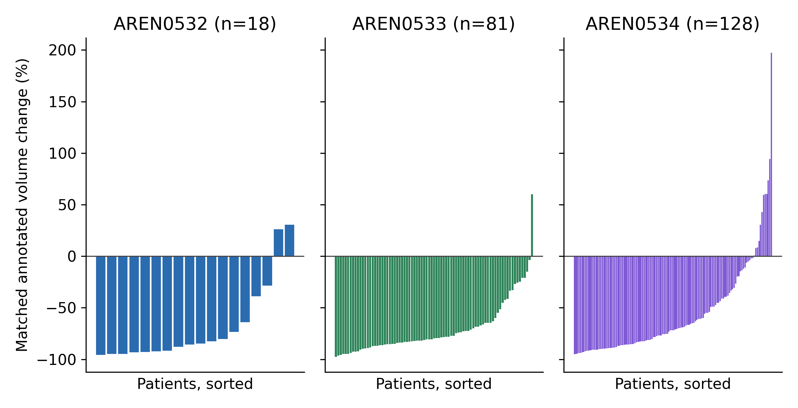
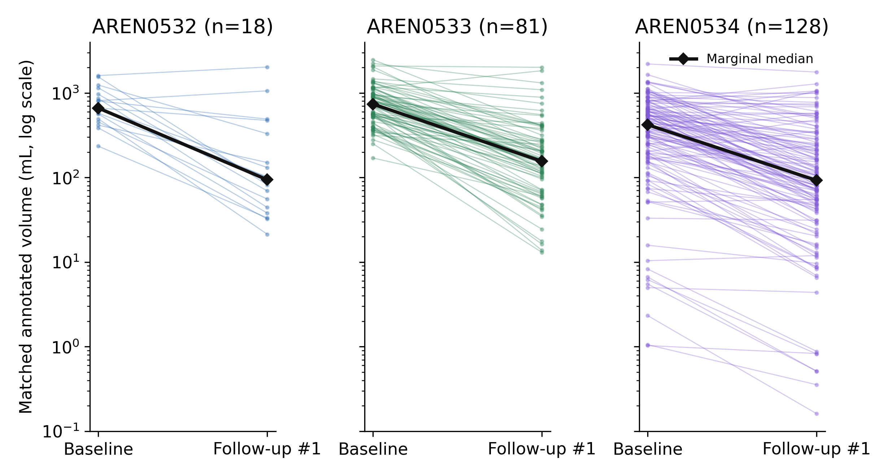

# Longitudinal Volumetry of Annotated Renal Target Lesions in Three Children's Oncology Group Trial Archives

Rachel Velasco¹ and Michael Martinez²

¹ Medical School, Washington University of Health and Science, San Pedro, Belize

² Transitional Year Residency Program, TidalHealth Peninsula Regional, Salisbury, Maryland, USA

Corresponding author: Michael Martinez, michael13414@gmail.com

## Abstract

**Background:** Public tumor annotations permit secondary measurement studies, but longitudinal analyses require consistent lesion identity, examination selection, and data provenance.

**Objective:** To describe changes in the recorded volumes of matched renal target lesions in three Children's Oncology Group trial archives.

**Materials and Methods:** We analyzed the corrected version 2 annotation releases for AREN0532, AREN0533, and AREN0534. The primary analysis required computed tomography (CT) at baseline and the first numbered follow-up, one examination per visit, identical renal tracking identifiers and compatible labels, and verification of each intended region against its source annotation object. The endpoint was percentage change in summed archive-reported target volume. Collection-specific medians and nonparametric 95% confidence intervals (CIs) were calculated. Magnetic resonance imaging (MRI) pairs and CT pairs separated by no more than 90 days were evaluated separately.

**Results:** Of 1047 subjects with renal segmentations, 227 met all primary criteria. Median percentage changes were AREN0532: -85.2% (95% CI -92.8% to -63.8%; n = 18); AREN0533: -79.6% (95% CI -82.5% to -74.7%; n = 81); AREN0534: -71.8% (95% CI -78.4% to -65.4%; n = 128). Median examination intervals were 47 days, 45 days, 43 days, respectively. Recorded volume decreased in 212 of 227 patients. The MRI analysis included 39 patients. Clinical treatment, surgical timing, and outcomes were not linked.

**Conclusions:** The retained annotation pairs showed substantial decreases in recorded renal target volume. These measurements describe selected matched lesions; clinical response, treatment efficacy, and prognostic utility require source-image and clinical validation.

**Keywords:** renal tumor volumetry; Wilms tumor; pediatric radiology; lesion tracking; imaging annotations; longitudinal imaging

## Introduction

Wilms tumor treatment combines surgery and systemic therapy, with the sequence and intensity determined by the clinical setting [1]. The Children's Oncology Group studies AREN0532, AREN0533, and AREN0534 represent different treatment populations. AREN0532 included patients with stage III favorable-histology disease, some of whom underwent delayed nephrectomy, whereas AREN0533 investigated treatment strategies for higher-risk disease, including response-adapted management of pulmonary metastases [2, 3]. AREN0534 included bilateral Wilms tumor, multicentric or bilaterally predisposed unilateral tumors, and diffuse hyperplastic perilobar nephroblastomatosis [4, 5, 6]. Membership in one of these archives therefore does not by itself establish an individual patient's diagnosis, treatment regimen, surgical status, or response-assessment interval.

Paired tumor-volume measurements before and after preoperative chemotherapy have previously been reported in both large cooperative-group cohorts and smaller institutional studies. The SIOP 93-01 analysis included 594 patients and reported tumor volume at diagnosis and after preoperative chemotherapy [7]. Studies of 52 patients with Wilms tumor, 68 patients with bilateral disease, and 56 patients with unilateral disease further examined volume change in relation to histology [8, 9, 10]. Measurement methods differ: dimensions-based estimates and segmentation-derived volumes need not agree, as demonstrated in a pediatric Wilms tumor MRI study [11]. These reports establish an existing literature on volumetric change rather than a previously unstudied phenomenon.

The Cancer Imaging Archive provides a separate opportunity to examine expert annotations in a reproducible secondary analysis [12]. Its AREN0532, AREN0533, and AREN0534 annotation datasets contain renal target-lesion contours created in a later annotation project and distributed with structured metadata [13, 14, 15]. We evaluated longitudinal changes in annotated renal target-lesion volume using the current metadata and annotation releases, with explicit checks of lesion selection, timepoint labels, and computational measurement. The aim was to describe the information supported by these archives and its limitations, rather than estimate treatment efficacy or validate a clinical response threshold.

## Materials and Methods

### Design and source data

This retrospective secondary analysis used publicly available, de-identified annotation objects and metadata retrieved on September 22, 2026. The corrected metadata releases were dated December 3, December 19, and December 22, 2025, for AREN0532, AREN0533, and AREN0534, respectively. The source files, retrieval addresses, and checksums were retained. The analysis plan was amended after a data-quality review of an earlier implementation whose results had already been examined. The dated amendment specified the revised endpoint, matching rules, and statistical presentation before the revised aggregate outcomes were calculated; it was not a prospectively registered protocol.

The analysis used version 2 of the AREN0532-Tumor-Annotations, AREN0533-Tumor-Annotations, and AREN0534-Tumor-Annotations datasets [13, 14, 15]. These annotations were created after the underlying trials to augment the archived imaging collections [16, 17, 18]. The dataset documentation describes initial annotation by radiologists followed by secondary review by US board-certified radiologists. The stated target-selection protocol allowed up to five lesions per scan and no more than two per organ, with longitudinal annotation of the selected targets. The endpoint is therefore the volume of selected annotated renal lesions, not the total volume of all renal disease. The archive's annotation protocol used RECIST 1.1 principles for target selection, but our volume-change endpoint is not a RECIST response classification [19].

No participants were recruited or contacted, and no identifiable private information was accessed. No institutional review board reviewed this secondary analysis, and no institutional approval or exemption number was issued. Source CT/MRI voxel images were not accessed, so no image-based rereading or independent confirmation of segmentation boundaries was performed.

### Examination and target selection

All subjects with at least one renal segmentation in the current metadata were screened. The primary analysis used CT-referenced renal segmentations at Pre-Dose and Post-Chemotherapy #1. Later numbered visits were not substituted when the first follow-up was missing. Eligibility required one source StudyInstanceUID and date at each visit, a strictly positive interval, and the same complete set of renal TrackingUIDs with compatible normalized target labels and laterality. Multiple CT series from one examination could contribute distinct targets, but each tracked target could contribute only one annotation per visit. Repeated target measurements and examinations from different dates were not summed.

Eligibility was checked against current RTSTRUCT objects. A unique intended region of interest (ROI) was located by its TrackingUID. The ROI name and tracking label had to be compatible with the metadata, and the patient identifier, source examination/date, referenced image series and modality, and stored ROI volume had to agree. An omitted numeric suffix in an ROI name was allowed only when its unique TrackingUID and explicitly stated kidney side matched; conflicting anatomy, sides, or numeric suffixes were not reconciled by inference. Unrelated or untracked ROIs in the same object were ignored. Seed-only objects, malformed intended contour-coordinate records, unresolved anatomical labels, and source-identity conflicts were excluded. Coordinate checks rejected nonclosed contours, fewer than three points, nonfinite or nonnumeric coordinates, and inconsistent declared point counts. Single-plane segmentations with a valid stored ROI volume could enter the primary analysis; they were not assigned an inferred slice thickness for geometric recomputation. One duplicated patient-identifier string was normalized using the matching raw patient header and retained series identifiers.

Historical metadata were used to detect annotation or source-series identifiers previously labeled postoperative or recurrent. Such conflicts were excluded from the required visits. Mutually exclusive first-failure exclusions were recorded for each patient. A missing annotation, a negative assessment, or a failed measurement was never assigned zero volume. All retained baseline targets had to be represented at follow-up; the endpoint therefore concerns persistent, evaluable target sets and may omit complete responders. The archive's shifted dates preserve longitudinal relationships, but calculated examination intervals were not interpreted as treatment duration. Treatment initiation, actual regimen, pathology, and surgical dates were not linked.

### Volume measurements and sensitivity analyses

The primary measurement was the intended ROI's archived DICOM ROI Volume value (tag 3006,002C), expressed in cubic centimeters, equivalent to milliliters. Its value was checked against the current metadata. For each retained patient, the same renal target set was summed at both visits. Percentage change was calculated as 100 × (follow-up volume − baseline volume) / baseline volume. A numerical increase was not classified as clinical progression, and these volumetric changes were not assigned RECIST response categories.

MRI-to-MRI pairs were analyzed separately using the same rules. A CT sensitivity analysis was restricted to examination intervals of 90 days or less, chosen before revised outcome calculation to assess the influence of longer intervals around the six- and 12-week assessment schedules described in the source trials [3, 4]. This restriction did not establish when treatment began or whether surgery occurred.

A computational sensitivity analysis compared archived volumes with volumes recomputed from the verified intended ROI contours. Polygons were projected onto a common plane basis and grouped by physical plane. Disjoint closed planar polygons were summed; explicit DICOM exclusive-or contours were combined using the corresponding topology. Ordinary overlapping/nested polygons, polygon topology unsupported by the conservative routine, nonparallel planes, and irregular plane spacing were excluded from recomputation. Unsupported topology can include self-intersecting or keyhole encodings and does not establish anatomical inaccuracy of the supplied segmentation. For uniformly spaced valid planes, summed areas were multiplied by spacing, including a half-spacing end extension at each end. This is a slab approximation. Comparisons included absolute and relative volume differences and patient-level percentage-change differences, restricted to patients whose complete matched target set was computable. These checks assess computational consistency within supplied annotations and do not validate their anatomical accuracy.

### Statistical analysis and reproducibility

The patient was the analysis unit. Results were reported separately for each collection as medians and interquartile ranges (IQRs). Nonparametric confidence intervals for median percentage change used central order statistics with exact binomial coverage of at least 95%; finite intervals were reported as not estimable when sample size was insufficient. These intervals assume independent patient observations and do not account for archive selection bias. Pooled results were descriptive. No between-collection treatment-effect tests or outcome-prediction models were fitted. Neither a pooled significance test nor correlation between volume methods was used as evidence of clinical validity. Age, stage, histology, and clinical outcomes were not analyzed because reliable patient-level clinical data were not linked.

The analysis used Python with NumPy, pandas, SciPy, pydicom, Shapely, and matplotlib. Exact software versions, the dated amendment, source verification records, patient-level inclusion/exclusion tables, and reproducible calculations accompany the analysis. The revised code, metadata snapshots, verification records, analysis outputs, and manuscript source are available at https://github.com/mmart196/research-tcia-wilms-volumetric/tree/revision/cureus-data-corrections-2026-09-22. The package identifies the precise dataset versions and records checksums for downloaded annotation objects. Earlier archived releases contain superseded analyses and are not the source of the revised results.

Large-language-model assistants were used in developing the analysis code and manuscript. This revision used ChatGPT and OpenAI Codex (OpenAI) for literature retrieval, code review and revision, source-data checks, statistical scripting, and manuscript drafting. Bibliographic identities were checked against PubMed and DataCite, and quantitative results were generated by scripted calculations. These procedures do not constitute independent clinical review or image-based confirmation of lesion identity. Responsibility for scientific decisions and final content remains with the human authors.

## Results

### Cohort selection

The current metadata contained 1047 subjects with at least one renal segmentation. Of these, 970 had a baseline CT-referenced renal segmentation, and 250 had CT renal segmentations at both required visit labels. After examination, target-matching, chronology, and source-object checks, 227 patients remained: 18 from AREN0532, 81 from AREN0533, 128 from AREN0534. These patients contributed 349 matched renal targets, each represented at both visits. Table 1 reports mutually exclusive exclusions. The selection rules excluded complete pairs when any required target was unresolved; missing targets were not replaced with zero.

**Table 1. Selection of the primary CT cohort.** Each excluded patient is counted once, at the first failed eligibility step. CT, computed tomography; ROI, region of interest.

| Stage or first failed criterion | AREN0532 | AREN0533 | AREN0534 | Total |
|---|---|---|---|---|
| Subjects with any renal segmentation | 535 | 276 | 236 | 1047 |
| No baseline renal segmentation in selected modality | 28 | 4 | 45 | 77 |
| No follow-up #1 renal segmentation in selected modality | 488 | 189 | 43 | 720 |
| Historical postoperative/recurrence label conflict | 0 | 0 | 0 | 0 |
| Missing/invalid identity, date, source, label or positive volume | 0 | 0 | 0 | 0 |
| Multiple source examinations/dates in a selected visit | 1 | 0 | 1 | 2 |
| Repeated target annotation within a selected visit | 0 | 0 | 0 | 0 |
| Different renal tracking sets or incompatible target labels | 0 | 0 | 13 | 13 |
| Follow-up examination not after baseline | 0 | 0 | 0 | 0 |
| Source ROI identity/volume verification unresolved | 0 | 2 | 6 | 8 |
| Included matched-target pair | 18 | 81 | 128 | 227 |

### Matched renal target volumes

Collection-specific median percentage changes were as follows: AREN0532: -85.2% (95% CI -92.8% to -63.8%; n = 18); AREN0533: -79.6% (95% CI -82.5% to -74.7%; n = 81); AREN0534: -71.8% (95% CI -78.4% to -65.4%; n = 128). Median examination intervals were AREN0532, 47.0 days (IQR 40.8 to 62.0 days); AREN0533, 45.0 days (IQR 40.0 to 48.0 days); AREN0534, 43.0 days (IQR 40.0 to 47.0 days). Table 2 provides volumes, changes, intervals, and target counts. Figure 1 displays every patient-level percentage change, and Figure 2 shows paired volumes for the same retained target sets.

**Table 2. Matched renal target volume changes by collection.** Values are median (IQR) unless indicated. Confidence intervals refer to the median of patient-level percentage changes. Pooled estimates are descriptive. CT, computed tomography; CI, confidence interval; IQR, interquartile range.

| Characteristic | AREN0532 (n = 18) | AREN0533 (n = 81) | AREN0534 (n = 128) |
|---|---|---|---|
| Baseline volume, mL | 661.2 (510.4 to 937.6) | 736.4 (518.8 to 981.5) | 419.6 (184.8 to 658.6) |
| Follow-up volume, mL | 94.0 (47.0 to 284.2) | 155.2 (71.4 to 269.1) | 92.3 (42.4 to 245.7) |
| Absolute change, mL | -473.1 (-750.9 to -277.0) | -486.1 (-760.6 to -333.5) | -200.1 (-439.4 to -64.0) |
| Percentage change, % | -85.2 (-92.7 to -66.2) | -79.6 (-85.6 to -66.2) | -71.8 (-86.0 to -41.1) |
| Examination interval, days | 47.0 (40.8 to 62.0) | 45.0 (40.0 to 48.0) | 43.0 (40.0 to 47.0) |
| 95% CI for median change, % | -92.8 to -63.8 | -82.5 to -74.7 | -78.4 to -65.4 |
| Decrease / increase / unchanged | 16 / 2 / 0 | 80 / 1 / 0 | 116 / 12 / 0 |
| Matched renal targets | 20 | 85 | 244 |
| Annotated laterality: right | 11 | 42 | 26 |
| Annotated laterality: left | 7 | 39 | 26 |
| Annotated laterality: bilateral | 0 | 0 | 76 |

In the pooled descriptive summary, baseline volume was 556.2 mL (IQR 321.9 to 859.7 mL) and follow-up volume was 117.2 mL (IQR 54.2 to 263.0 mL). Median patient-level percentage change was -77.2% (IQR -86.4 to -50.4%) (95% CI -80.6% to -72.4%). Recorded volume decreased in 212 patients, increased in 15, and was unchanged in zero. These measurements combine heterogeneous collection populations and are not estimates of a common treatment effect.

**Figure 1. Percentage changes in matched renal target volume in the primary CT cohort.** Each bar represents one patient, sorted within collection. Negative values indicate a decrease in recorded volume. The full observed range is displayed. Collection sample sizes are shown above each panel. CT, computed tomography.

**Figure 2. Paired renal target volumes in the primary CT cohort.** Each colored line connects the baseline and first numbered follow-up volumes for one patient with the same target set at both visits. The black line and diamond markers show the marginal median at each visit. The vertical axis is logarithmic. These are two observations per patient, not trajectories through intermediate visits. CT, computed tomography.

### Timing and measurement sensitivities

The primary cohort's recorded examination intervals ranged from 22 to 388 days; four patients had intervals longer than 90 days. Restricting the analysis to intervals of 90 days or less retained 223 CT pairs. The separate MRI analysis retained 39 pairs; zero patients contributed to both modality cohorts. Collection-specific sensitivity estimates are shown in Table 3. These analyses do not establish equivalent acquisition or treatment conditions across collections. A supplementary scatter plot displays examination interval against percentage change.

**Table 3. Sensitivity analyses by collection.** CT pairs within 90 days are a subset of the primary cohort. MRI pairs were selected independently with the same matching and verification rules. Values are median (IQR) unless indicated. CI, confidence interval; CT, computed tomography; IQR, interquartile range; MRI, magnetic resonance imaging.

| Analysis | Collection | n | Change, % (IQR) | 95% CI |
|---|---|---|---|---|
| CT, interval ≤90 days | AREN0532 | 16 | -83.6 (-92.5 to -57.6) | -92.8 to -38.9 |
| CT, interval ≤90 days | AREN0533 | 81 | -79.6 (-85.6 to -66.2) | -82.5 to -74.7 |
| CT, interval ≤90 days | AREN0534 | 126 | -71.4 (-85.7 to -41.1) | -77.4 to -64.9 |
| MRI, matched targets | AREN0532 | 0 | Not estimable | Not estimable |
| MRI, matched targets | AREN0533 | 0 | Not estimable | Not estimable |
| MRI, matched targets | AREN0534 | 39 | -69.5 (-87.0 to -17.1) | -80.5 to -40.5 |

Contour recomputation was possible for 432 of 698 selected ROI-timepoint observations. Reasons for unavailable geometric measurements were unsupported polygon topology (n = 249), irregular plane spacing (n = 11), single plane (n = 3), overlapping or nested ordinary closed planar polygons (n = 3). Among computable observations, median absolute relative difference from the archived ROI volume was 4.0%; 126 observations differed by more than 10%. These are repeated ROI-timepoint observations, not independent patients or independent segmentation validations. Complete geometric measurements at both visits were available for 57 of 227 patients. In that same subset, the pooled median percentage change was -78.0% using archived volumes and -77.4% using recomputed volumes. The median absolute patient-level difference was 0.6 percentage points, with signed differences ranging from -10.5 to 4.1 percentage points. The numerical direction of change differed in zero patients. No partial target sums were substituted for uncomputable complete pairs.

## Discussion

The revised matched-target analysis retained 227 CT pairs and found substantial decreases in recorded renal lesion volume within each collection. Sensitivity analyses examined the effects of interval restrictions, modality, and volume computation, while eligibility checks restricted which archive records could support a paired measurement. The clinical significance of the measured changes cannot be established from the annotation data alone.

This analysis concerns longitudinal measurements of selected annotated renal lesions in trial-derived archives. Its unit of observation and target-selection rules differ from those of a prospective therapeutic study. The findings should be interpreted as changes in recorded target-lesion volume among evaluable annotation pairs. They do not establish how much all renal disease changed, whether a patient achieved a clinical response, or whether one treatment strategy was more effective than another.

The contribution is an auditable secondary measurement analysis. Earlier studies already demonstrated preoperative volume changes in Wilms tumor, including the large SIOP 93-01 cohort and institutional series with histologic information [7, 8, 9, 10]. Differences between those studies and the present analysis include target selection, lesion matching, imaging methods, treatment setting, and timing. Their numerical response estimates should not be compared as estimates of relative treatment efficacy. A public contour-based analysis complements this literature by making eligibility decisions and calculations inspectable; reproducibility alone does not establish clinical validity.

Several features constrain interpretation. First, the annotation protocol selected targets and did not comprehensively delineate every lesion [13, 14, 15]. Requiring a lesion to be evaluable at both timepoints can preferentially retain visible or persistent lesions. An absent annotation cannot be assumed to represent complete resolution. Similarly, adding available lesions at each visit without confirming correspondence can confound biological change with a changing target set. Label-based correspondence is an operational matching rule; it does not independently prove anatomical identity on the original images.

Second, contour-derived volume depends on the segmentation boundaries and on how contour planes are integrated. Agreement with a volume stored by the annotation software checks numerical consistency within the same annotation, not the accuracy of the boundary against anatomy. Rank correlation alone does not measure agreement. Dimensions-based and segmentation-derived measurements have differed in prior Wilms tumor studies, so measurement method must remain explicit when results are compared [11]. The current analysis does not establish interobserver or intraobserver reproducibility. The complete-pair geometric sensitivity subset was substantially smaller than the primary cohort, so its agreement results cannot be generalized to all retained annotations.

Third, the source trials enrolled heterogeneous clinical populations [2, 3, 4, 5, 6]. Without patient-level clinical linkage, collection names cannot substitute for stage, histology, regimen, surgical timing, or confirmed bilateral disease. Archive-relative imaging intervals, where available, describe recorded imaging chronology and should not be equated with treatment duration without treatment dates. Comparisons across collections remain descriptive even when scan intervals can be calculated.

Fourth, an increase in recorded volume is not sufficient to identify adverse histology. An earlier bilateral Wilms tumor series associated growth with stromal-predominant tumors, whereas a smaller mixed cohort found anaplasia in two of three tumors that enlarged by more than 10% [9, 8]. Whole-lesion volume also differs from residual viable blastema volume, which combines imaging and pathological information and has been studied as an outcome-associated marker [20]. The present annotations cannot determine those tissue components or support treatment recommendations.

Further investigation would require source-image review, confirmation of lesion correspondence and completeness, and linkage to clinical treatment, pathology, and outcome data. Such validation should precede any proposed response threshold or use in surgical or treatment planning. Reporting the present measurements with their eligibility rules and limitations provides a basis for that work without treating archive-derived volume change as a validated surrogate endpoint.

## Conclusions

Trial-derived renal target-lesion annotations can support a transparent analysis of longitudinal volumetric measurements when data versions, lesion correspondence, and timepoint definitions are explicit. The resulting endpoint describes selected annotated lesions and cannot be assumed to represent total renal tumor burden or a clinical response category.

Interpretation remains limited by annotation selection and the absence of patient-level treatment, pathology, and outcome linkage. The measurements are suitable for methodological and descriptive research; their clinical significance requires independent validation.

## Acknowledgments

The authors acknowledge the Children's Oncology Group trial investigators, the annotation creators, and The Cancer Imaging Archive for making the research resources available.

## References

1. Irtan S, Ehrlich PF, Pritchard-Jones K: Wilms tumor: "State-of-the-art" update, 2016. Semin Pediatr Surg. 2016, 25:250-256. 10.1053/j.sempedsurg.2016.09.003

2. Fernandez CV, Mullen EA, Chi YY, et al.: Outcome and prognostic factors in stage III favorable-histology Wilms tumor: a report from the Children's Oncology Group study AREN0532. J Clin Oncol. 2018, 36:254-261. 10.1200/JCO.2017.73.7999

3. Dix DB, Seibel NL, Chi YY, et al.: Treatment of stage IV favorable histology Wilms tumor with lung metastases: a report from the Children's Oncology Group AREN0533 study. J Clin Oncol. 2018, 36:1564-1570. 10.1200/JCO.2017.77.1931

4. Ehrlich P, Chi YY, Chintagumpala MM, et al.: Results of the first prospective multi-institutional treatment study in children with bilateral Wilms tumor (AREN0534): a report from the Children's Oncology Group. Ann Surg. 2017, 266:470-478. 10.1097/SLA.0000000000002356

5. Ehrlich PF, Chi YY, Chintagumpala MM, et al.: Results of treatment for patients with multicentric or bilaterally predisposed unilateral Wilms tumor (AREN0534): a report from the Children's Oncology Group. Cancer. 2020, 126:3516-3525. 10.1002/cncr.32958

6. Ehrlich PF, Tornwall B, Chintagumpala MM, et al.: Kidney preservation and Wilms tumor development in children with diffuse hyperplastic perilobar nephroblastomatosis: a report from the Children's Oncology Group study AREN0534. Ann Surg Oncol. 2022, 29:3252-3261. 10.1245/s10434-021-11266-6

7. Graf N, van Tinteren H, Bergeron C, et al.: Characteristics and outcome of stage II and III non-anaplastic Wilms' tumour treated according to the SIOP trial and study 93-01. Eur J Cancer. 2012, 48:3240-8. 10.1016/j.ejca.2012.06.007

8. Taskinen S, Leskinen O, Lohi J, Koskenvuo M, Taskinen M: Effect of Wilms tumor histology on response to neoadjuvant chemotherapy. J Pediatr Surg. 2019, 54:771-774. 10.1016/j.jpedsurg.2018.05.010

9. Duncan C, Sarvode Mothi S, Santiago TC, et al.: Response of bilateral Wilms tumor to chemotherapy suggests histologic subtype and guides treatment. J Natl Cancer Inst. 2024, 116:1230-1237. 10.1093/jnci/djae072

10. Benlhachemi S, Khattab M, Hattoufi K, Abouqal R, El Fahime E: Impact of neoadjuvant chemotherapy on tumour volume in unilateral Wilms tumour histotypes: a retrospective study. BMC Cancer. 2025, 25:1031. 10.1186/s12885-025-14177-x

11. Buser MAD, van der Steeg AFW, Wijnen MHWA, et al.: Radiologic versus segmentation measurements to quantify Wilms tumor volume on MRI in pediatric patients. Cancers (Basel). 2023, 15:2115. 10.3390/cancers15072115

12. Clark K, Vendt B, Smith K, et al.: The Cancer Imaging Archive (TCIA): maintaining and operating a public information repository. J Digit Imaging. 2013, 26:1045-57. 10.1007/s10278-013-9622-7

13. Rozenfeld M, Jordan P: Annotations for vincristine, dactinomycin, and doxorubicin with or without radiation therapy or observation only in treating younger patients who are undergoing surgery for newly diagnosed stage I, II, or III Wilms' tumor (AREN0532-Tumor-Annotations) (Version 2) (Dataset). The Cancer Imaging Archive; 2023. 10.7937/kja4-1z76

14. Rozenfeld M, Jordan P: Annotations for combination chemotherapy with or without radiation therapy in treating young patients with newly diagnosed stage III or stage IV Wilms tumor (AREN0533-Tumor-Annotations) (Version 2) (Dataset). The Cancer Imaging Archive; 2023. 10.7937/wfcc-da41

15. Rozenfeld M, Jordan P: Annotations for combination chemotherapy and surgery in treating young patients with Wilms tumor (AREN0534-Tumor-Annotations) (Version 2) (Dataset). The Cancer Imaging Archive; 2023. 10.7937/n930-bm78

16. Fernandez CV, Mullen EA, Chi YY, et al.: Vincristine, dactinomycin, and doxorubicin with or without radiation therapy or observation only in treating younger patients who are undergoing surgery for newly diagnosed stage I, stage II, or stage III Wilms' tumor (AREN0532) (Version 1) (Dataset). The Cancer Imaging Archive; 2022. 10.7937/6pj1-m859

17. Dix DB, Seibel NL, Chi YY, et al.: Combination chemotherapy with or without radiation therapy in treating young patients with newly diagnosed stage III or stage IV Wilms tumor (AREN0533) (Version 1) (Dataset). The Cancer Imaging Archive; 2022. 10.7937/sjez-cj78

18. Ehrlich P, Chi YY, Chintagumpala MM, et al.: Combination chemotherapy and surgery in treating young patients with Wilms tumor (AREN0534) (Version 1) (Dataset). The Cancer Imaging Archive; 2021. 10.7937/tcia.5m9s-6y97

19. Eisenhauer EA, Therasse P, Bogaerts J, et al.: New response evaluation criteria in solid tumours: revised RECIST guideline (version 1.1). Eur J Cancer. 2009, 45:228-47. 10.1016/j.ejca.2008.10.026

20. Furtwängler R, Dandis R, van Tinteren H, et al.: Residual absolute volume of blastema as a predictor of clinical outcomes in patients with Wilms tumor: a report from the SIOP WT 2001 study. J Clin Oncol. 2026, 44:1238-1248. 10.1200/JCO-25-01755
